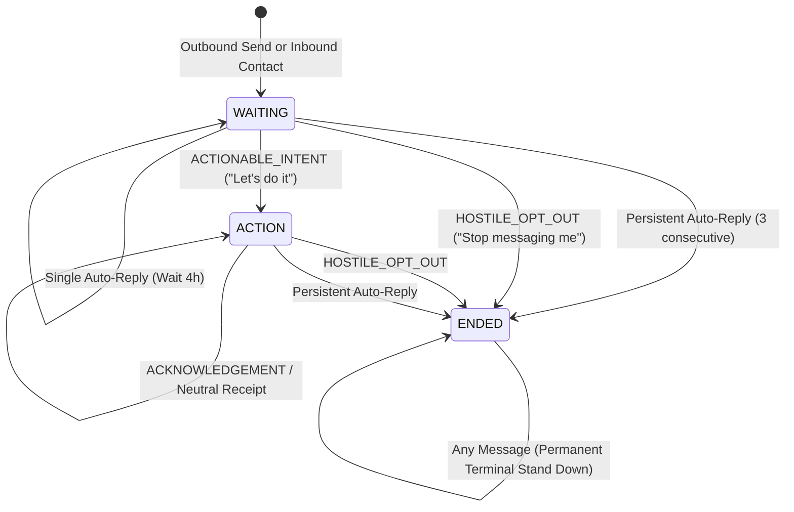

# Phase 6 — Deterministic Conversation & Reply Intelligence Policy

## 1. Executive Summary & Architectural Invariant

Phase 2 answers: **WHAT should Vera do?**  
Phase 3 answers: **HOW should Vera express it?**  
Phase 5 answers: **CAN THIS EXACT OUTREACH BE TRANSMITTED RIGHT NOW?**  
Phase 6 answers: **HOW SHOULD VERA INTERPRET INBOUND REPLIES AND TRANSITION CONVERSATIONAL STATE SAFELY?**

```text
Inbound Merchant / Customer Reply (/v1/reply)
                   ↓
Phase 6: Deterministic Intent Classification (Priority Order)
                   ↓
Phase 6: Conversation State Machine (WAITING / ACTION / ENDED)
                   ↓
Phase 6: Bounded Reply Response (send / wait / end)
```

### Core Policy Statement
> **Phase 6 interprets conversational intent and controls conversation state. It does not independently decide which business action is best.**

Phase 6 owns conversation interpretation, state transitions, bounded reply behavior, and conversational safety. It does **not** create new `ActionType` values, modify Phase 2 scoring, change category/merchant facts, or invent new business actions.

---

## 2. Conversation State Machine



### State Definitions:
1. **`WAITING`**:
   - Initial active state after an outreach is sent or when waiting for user response.
   - Neutral acknowledgements (`"ok"`, `"thanks"`) keep the system in `WAITING` with an intentional backoff (`action="wait"`, `wait_seconds=86400`) to **prevent acknowledgement loops**.
2. **`ACTION`**:
   - Active execution state entered when the merchant expresses concrete commitment (`ACTIONABLE_INTENT`).
   - Returns actioning copy (`"Drafting now — sending you the complete preview shortly..."`), using `done`, `sending`, `draft`, `here`, `confirm`, `proceed`, `next`, with zero qualifying questions.
3. **`ENDED`**:
   - Strictly terminal state entered upon explicit opt-out (`HOSTILE_OPT_OUT`) or persistent bot loop (`consecutive_auto_replies >= 3`).
   - Permanently stand down fail-closed (`action="end"`).

---

## 3. Deterministic Intent Taxonomy & Priority Order

The intent classifier is completely deterministic (regex pattern matching, normalized text, zero LLM, zero network).

### Priority Precedence:
1. **Empty / Whitespace**:
   - Returns safe `action="wait"`, `wait_seconds=300`.
2. **Auto-Reply Detection (`is_auto`)**:
   - Evaluates canned responder phrases: `"thank you for contacting"`, `"team will respond shortly"`, `"automated message"`, `"auto-reply"`, `"our team will respond"`, `"away from the phone"`.
3. **`HOSTILE_OPT_OUT` (Absolute Precedence)**:
   - Evaluated before any positive or action words.
   - Compound sentences like `"Okay, but stop messaging me"` strictly resolve to `HOSTILE_OPT_OUT`.
   - Patterns: `stop messaging`, `not interested`, `useless spam`, `unsubscribe`, `leave me alone`, `remove me`, `this is spam`, `do not contact`, `don't message`, `stop`, `opt out`.
4. **`ACTIONABLE_INTENT`**:
   - Concrete willingness to proceed: `"let's do it"`, `"what's next?"`, `"how do i start"`, `"proceed"`, `"go ahead"`, `"do it"`, `"send the draft"`, `"share the preview"`, `"can we do this"`, `"sign me up"`.
5. **`CLARIFICATION` (Domain Redirection)**:
   - Out-of-scope business inquiries (GST filing, tax accounting, legal advice, personal loans).
   - Courteously redirected to professional advisors without dropping conversation context.
6. **`ACKNOWLEDGEMENT` (Loop Prevention)**:
   - Passive receipt tokens: `"ok"`, `"okay"`, `"thanks"`, `"thank you"`, `"got it"`, `"sure"`, `"understood"`, `"noted"`, `"fine"`, `"cool"`, `"received"`.
   - Distinguishes acknowledgement from actionable intent: simple acknowledgement does **not** trigger action mode or spam the recipient.
7. **`NEUTRAL`**:
   - General ongoing conversational replies.

---

## 4. Auto-Reply Loop Defense & Consecutive Tail Tracking

To prevent infinite ping-pong between automated responders:
1. **Consecutive Tail Tracking**:
   - The loop counter tracks consecutive auto-replies **at the tail of the conversation**.
   - Consecutive sequence: `AUTO -> AUTO -> AUTO` $\implies$ 3 consecutive $\implies$ `action="end"`.
   - Interleaved sequence: `AUTO -> HUMAN -> AUTO -> HUMAN -> AUTO` $\implies$ human turn resets counter to 0; does **not** end prematurely.
2. **Single Auto-Reply Backoff**:
   - `action="wait"`, `wait_seconds=14400` (4 hours) allowing the business owner time to resume.

---

## 5. Hostile / Opt-Out Terminality

- Once `HOSTILE_OPT_OUT` is classified, the conversation transitions immediately to `ENDED`.
- **Zero persuasion or follow-up**: Vera does not send apologies, promotional counter-offers, or survey questions.
- Fail-closed terminal response: `action="end"`.

---

## 6. Conversation & Tenant Isolation

- Active conversations are tracked per `conversation_id` inside `ConversationStore`.
- Thread-safe concurrency via `threading.RLock`.
- **Isolation Invariants**:
  - Inbound messages to Conversation A cannot alter the state, turn count, or auto-reply counter of Conversation B.
  - Merchant A conversations cannot bleed into Merchant B conversations.

---

## 7. Determinism & Zero Wall-Clock Dependency

- State transitions and responses depend purely on:
  `(previous_state, incoming_message, turn_number)`
- Zero usage of `datetime.now()`, `time.time()`, random number generators, or external models.
- Simulation timestamp in `received_at` is preserved as metadata.

---

## 8. Architectural Boundary Proof: Not a Second Business Decision Engine

| Capability | Responsible Layer | Phase 6 Authority |
| :--- | :--- | :--- |
| **Select business action & target candidate** | Phase 2 (`decide()`) | ❌ **FORBIDDEN** (Phase 6 cannot select offers or score triggers) |
| **Compose grounded message copy & CTA** | Phase 3 (`compose()`) | ❌ **FORBIDDEN** (Phase 6 uses bounded reply protocol copy) |
| **Deduplication & Transmission Governance** | Phase 5 (`evaluate_outreach()`) | ❌ **FORBIDDEN** (Phase 6 does not alter exact deduplication) |
| **Inbound intent classification & state transitions** | Phase 6 (`process_turn()`) | ✅ **EXCLUSIVE AUTHORITY** |
| **Auto-reply loop defense & hostile opt-out** | Phase 6 (`ConversationStore`) | ✅ **EXCLUSIVE AUTHORITY** |
